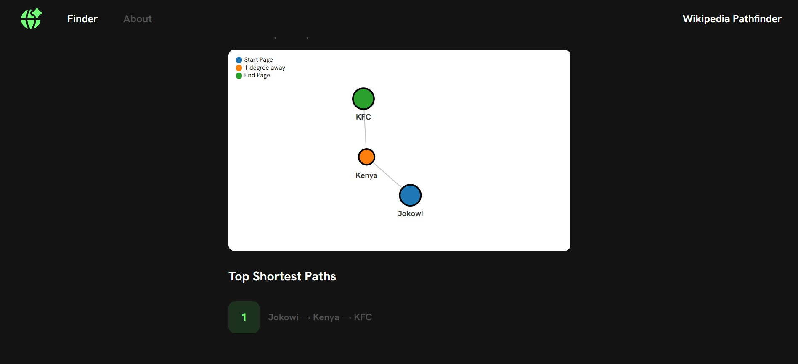
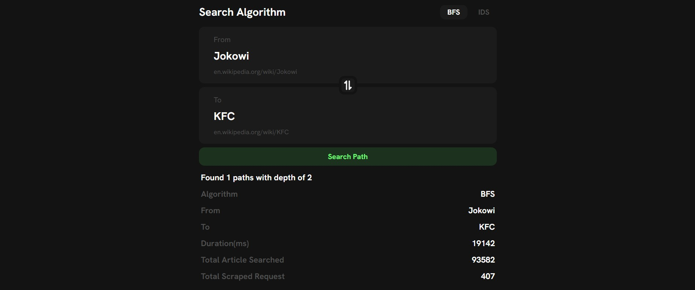

<h1 align="center"> Tugas Besar 2 IF2211 Strategi Algoritma</h1>
<h1 align="center">  Pemanfaatan Algoritma BFS dan IDS dalam Permainan WikiRace </h1>

## Identitas Pengembang Program
### **Kelompok 7:  TheYuds**
|   NIM    |                  Nama                  |
| :------: | :------------------------------------: |
| 13522055 |            Benardo             |
| 13522073 |            Juan Alfred Widjaya             |
| 13522115 |            Derwin Rustanly             |

## Deskripsi Program
WikiRace atau Wiki Game adalah permainan yang melibatkan Wikipedia, sebuah ensiklopedia daring gratis yang dikelola oleh berbagai relawan di dunia, dimana pemain mulai pada suatu artikel Wikipedia dan harus menelusuri artikel-artikel lain pada Wikipedia (dengan mengeklik tautan di dalam setiap artikel) untuk menuju suatu artikel lain yang telah ditentukan sebelumnya dalam waktu paling singkat atau klik (artikel) paling sedikit. 


Repositori ini berisi implementasi algoritma BFS (Breadth-First Search) dan (Iterative Deepening Search) untuk menentukan rute terpendek di antara kedua artikel wikipedia dengan aplikasi yang berbasis website dengan algoritma dalam bahasa pemrograman Go. Adapun kakas pembuatan aplikasi berbasis website yang akan digunakan meliputi React yang merupakan framework dari bahasa pemrograman Javascript.

## Requirements Program
- Docker Dekstop (https://www.docker.com/products/docker-desktop/)

## Set Up dan Build Program
1. Silahkan lakukan clone repositori ini dengan cara menjalankan perintah berikut pada terminal
    ```
    git clone https://github.com/DerwinRustanly/Tubes2_JuBender.git
    ```


2.  Jalankan perintah berikut pada terminal untuk menjalankan website
    ```
    docker-compose up --build
    ```

3. Jalankan browser dan buka laman untuk menjalankan website
    ```
    localhost:3000
    ```
5. Setelah pengguna berhasil menjalankan website, pengguna dapat memilih algoritma pencarian, baik dengan menggunakan algoritma BFS maupun IDS. 
6. Setelah pengguna memilih algoritma pencarian, pengguna menuliskan judul artikel Wikipedia asal dan tujuan, program juga akan memberikan rekomendasi artikel Wikipedia berdasarkan judul yang dimasukkan oleh pengguna.
7. Program akan menampilkan rute terpendek antara kedua artikel dalam bentuk visualisasi graf, beserta waktu eksekusi, jumlah artikel yang dilalui, beserta kedalaman pencarian.

## Dokumentasi Program




